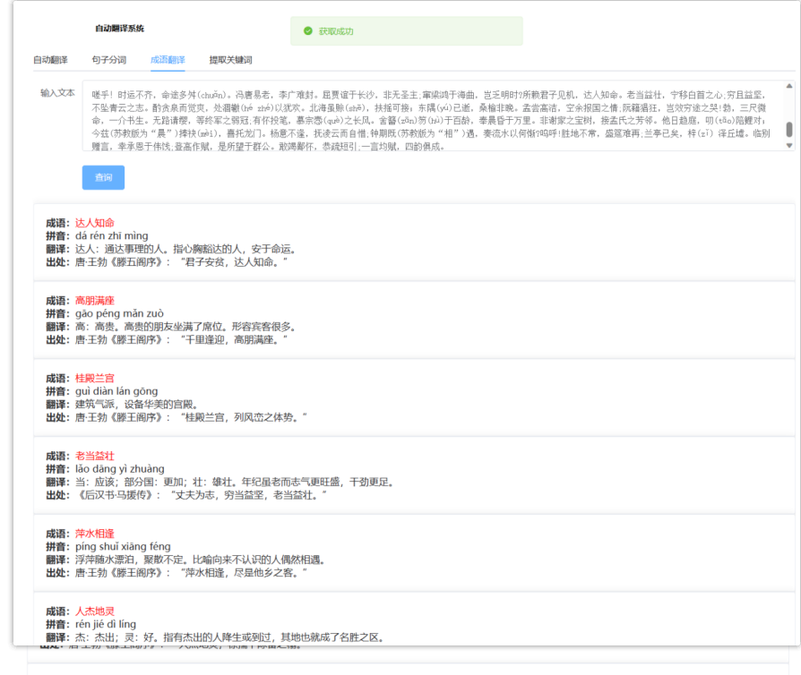

# 1、项目功能简介
自然语言处理一个机器翻译系统前端，该系统能够实现自然语言处理中
语种识别、拼写纠错、机器翻译、句子分词、成语翻译、提取关键词功能。

# 2、项目启动

### 依赖下载
```
yarn install
```

### 启动项目
```
yarn serve
```

### 打包项目
```
yarn build
```
# 3、功能介绍

### 1 功能用例


### 2 登录页


### 3 拼写纠错和机器翻译


### 4 成语解释


### 5 提取关键词


